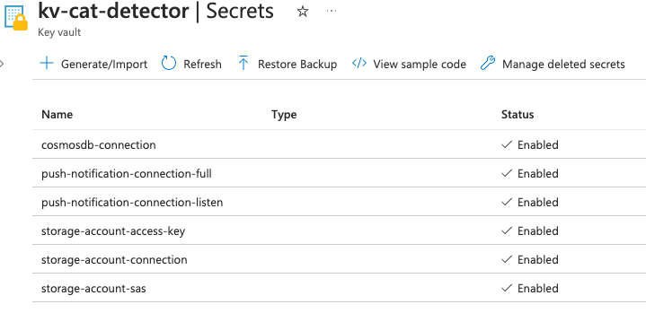
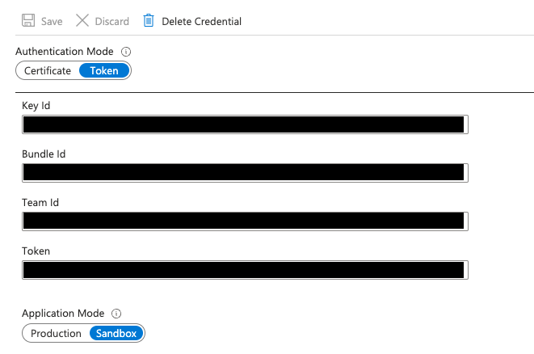

This project provides a solution that detects a cat using computer vision and sends push notifications to an iOS app.

Project folder structure:

- `cv`: Computer vision using YOLO and Python
- `infra`: Azure resources and Bicep templates
- `ios`: iOS app receives push notifications and display cat detection images

## Required softwares

- [Python3](https://www.python.org/downloads/)
- [Azure Cli](https://learn.microsoft.com/en-us/cli/azure/install-azure-cli)
- [Azure Function Core Tools](https://learn.microsoft.com/en-us/azure/azure-functions/functions-run-local?tabs=v4%2Cmacos%2Ccsharp%2Cportal%2Cbash)
- [Xcode](https://developer.apple.com/xcode/)

## Install project dependencies

Navigate to the `cv` folder, install YOLO v8 and Azure storage dependencies:

```bash
pip3 install ultralytics
pip3 install azure-storage-blob azure-identity
```

## Deploy Azure resources and services

Navigate to the `infra` folder, start the deployment by running:

```bash
./deploy.sh
```

If you want to deploy Azure Functions only, run

```bash
./publish-func.sh
```

If necessary, mark the bash script as executable:

```
chmod +x deploy.sh
chmod +x publish-func.sh
```

## Setup configurations

The necessary configurations are captured in Azure Key Vaults:



### Configure computer vision

1. Go to the `cv` folder
2. Rename `.env.example` to `.env`
3. Copy `storage-account-connection` value and paste to `.env` as `AZURE_STORAGE_CONNECTION` value

### Configure Azure Notification Hubs

For the push notification to work, you need to have APNs (Apple Push Notification service) setup under your Apple developer account. Follow this tutorial to setup APNs: [link](https://learn.microsoft.com/en-us/azure/notification-hubs/ios-sdk-get-started)

Once APNs credentials are ready, setup the values required by Notification Hub:


### Configure iOS app

For the iOS app to listen to push notifications and display images, you need:

1. Go to folder `ios/CatDetector/CatDetector`
2. Rename `Settings.example.plist` to `Settings.plist`
3. Copy `push-notification-connection-listen` from Key Vaults and save to `Settings.plist`
4. Open Function App from Azure API portal, copy the function url of `CatDetectionAPI`, then save to `Settings.plist` as `ApiUrl`

## Run the project

Go to the `cv` folder, then start the computer vision and start detecting cat by running:

```bash
python3 detector.py
```

## Additional references and resources

- [YOLO v8](https://github.com/ultralytics/ultralytics)
- [Generate Apple Push Notification Service (APN) certificate](https://learn.microsoft.com/en-us/azure/notification-hubs/ios-sdk-get-started)
- [Example iOS image viewer](https://github.com/Azure/azure-storage-ios/blob/master/BlobSample/BlobSample/BlobListTableViewController.swift)
- [Generate Blob Storage SAS using Azure Function](https://github.com/Azure-Samples/functions-dotnet-sas-token/blob/master/GetSasToken-Net/run.csx)
- [Azure Functions C# script (.csx) developer reference](https://learn.microsoft.com/en-us/azure/azure-functions/functions-reference-csharp?tabs=functionsv2)
- [Trigger Azure Functions using an event subscription](https://learn.microsoft.com/en-us/azure/azure-functions/functions-event-grid-blob-trigger?pivots=programming-language-csharp)
